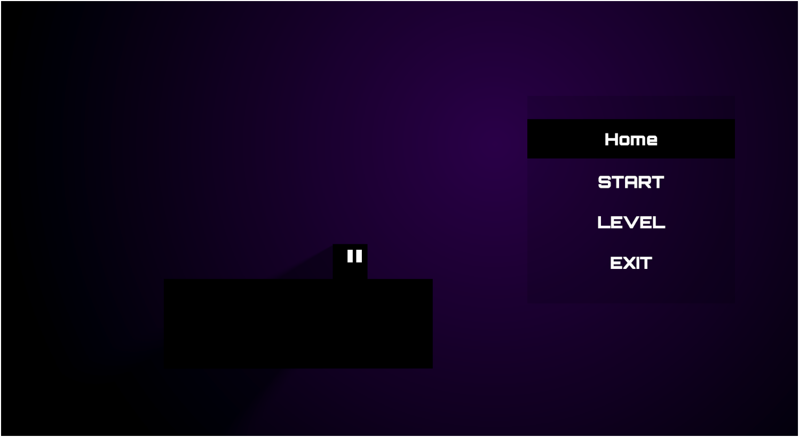

# 2D Platform Game (First Project)
#### Game Link : https://vignesh53612gmailcom.itch.io/2d-platformer
This is my **first game project**, created as a learning experience and uploaded to GitHub.  
The game features a simple box-style character, a pause/menu system, and multiple options like Start, Level selection, and Exit.

##  Features

- Minimalist UI with a dark purple theme
- Pause menu with:
  - Home
  - Start
  - Level
  - Exit
- Simple and clean game mechanics
- Beginner-friendly project structure

## 📸 Screenshots

